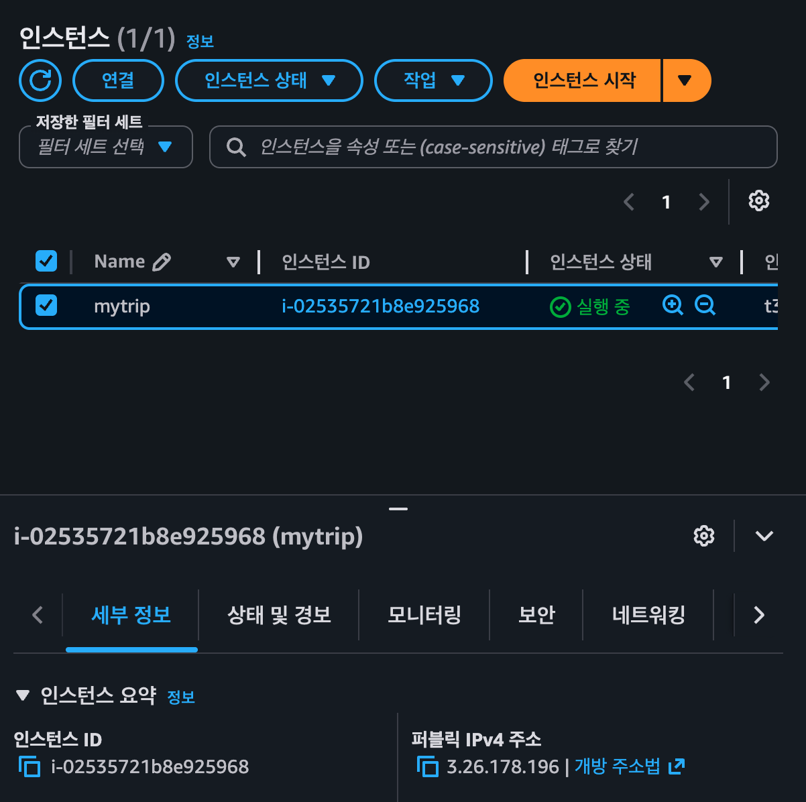
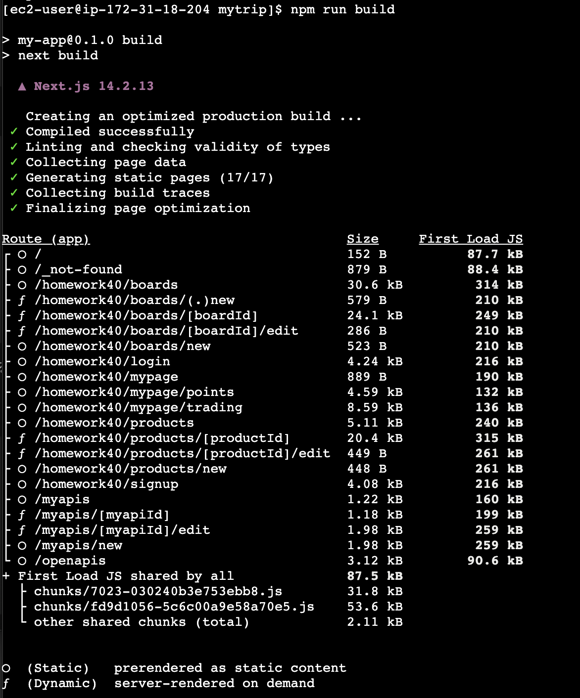
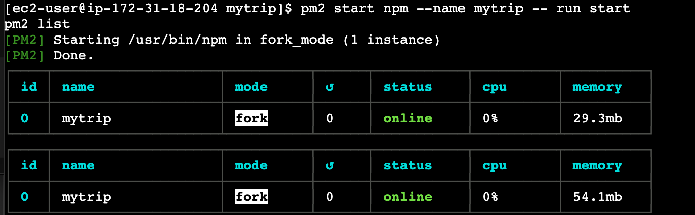
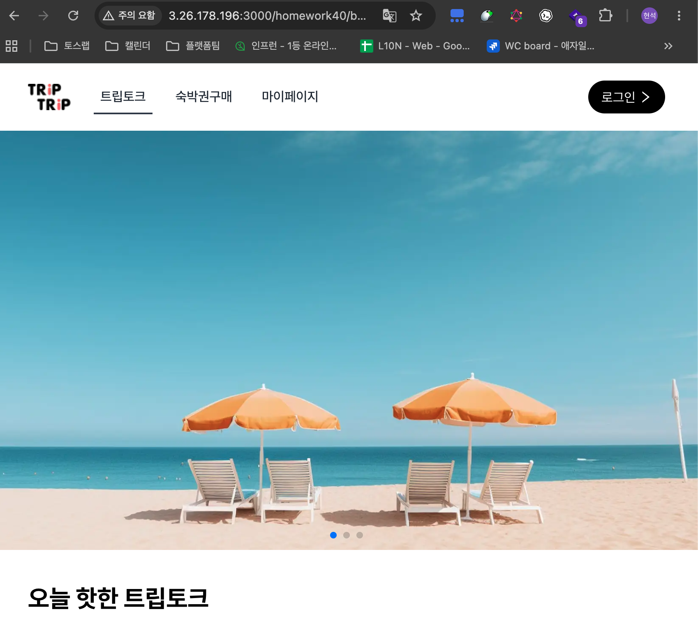

# 2026-06-11 AWS EC2 배포 기록

## 목표

`homework40` 기준으로 정리한 Next.js 앱을 AWS EC2에 배포하고, 퍼블릭 IP로 브라우저에서 접속되는지 확인했다.

이번 실습의 목표는 도메인, HTTPS, 로드밸런서까지 완성하는 것이 아니라 다음 흐름을 직접 경험하는 것이었다.

- EC2 인스턴스 생성
- SSH 접속
- Node.js 프로젝트 설치
- Next.js 프로덕션 빌드
- PM2로 서버 백그라운드 실행
- 보안 그룹에서 3000 포트 개방
- 퍼블릭 IP로 브라우저 접속 확인

## 배포 환경

- AWS EC2
- Amazon Linux 2023
- 인스턴스 이름: `mytrip`
- Node.js: `v20.20.2`
- Next.js: `14.2.13`
- 실행 포트: `3000`
- 접속 방식: `http://퍼블릭IP:3000`

도메인, Route 53, ACM 인증서, HTTPS 연결은 이번 실습 범위에서 제외했다. 추가 비용을 피하기 위해 퍼블릭 IP 접속까지만 확인했다.

## 스크린샷 증거

### 1. EC2 인스턴스 실행 상태

EC2 인스턴스가 실행 중이고 퍼블릭 IPv4 주소가 할당된 것을 확인했다.



### 2. 보안 그룹 인바운드 규칙

외부 접속을 위해 `3000` 포트를 열고, SSH 접속을 위해 `22` 포트가 열려 있는 것을 확인했다.


### 3. Next.js 빌드 성공

`npm run build`가 정상적으로 완료되었고, route 목록이 출력되는 것을 확인했다.



### 4. PM2 서버 실행

`pm2`로 `mytrip` 프로세스를 실행했고, 상태가 `online`인 것을 확인했다.



### 5. 브라우저 접속 성공

브라우저에서 `http://퍼블릭IP:3000` 주소로 접속해 실제 앱 화면이 렌더링되는 것을 확인했다.



## 사용한 주요 명령어

### 패키지 설치와 빌드

처음에는 `next: command not found`가 발생했다. 원인은 `node_modules`가 설치되지 않아 `node_modules/.bin/next`를 찾을 수 없었기 때문이다.

```bash
npm install
npm run build
```

이후 빌드가 `Creating an optimized production build ...`에서 조용히 끝나는 특이 케이스가 있었다. 최종적으로는 기존 설치 결과와 lock 파일을 정리한 뒤 재설치하여 해결했다.

```bash
rm -rf node_modules package-lock.json .next build.log
npm install
npm run build
```

학습 중에는 이 방식으로 해결했지만, 실무에서는 lock 파일을 유지하고 다음 방식이 더 일반적이다.

```bash
rm -rf node_modules .next
npm ci
npm run build
```

## PM2 실행

터미널에서 직접 `npm run start`를 실행하면 SSH 터미널을 닫을 때 서버도 함께 종료된다. 그래서 PM2를 사용해 백그라운드 프로세스로 실행했다.

```bash
sudo npm install -g pm2
pm2 start npm --name mytrip -- run start
pm2 list
```

`pm2 list`에서 `mytrip` 상태가 `online`이면 서버가 백그라운드에서 실행 중이라는 뜻이다.

## 확인한 개념

### S3 버킷 이름과 도메인

S3 버킷 이름은 도메인을 구매해야만 사용할 수 있는 값이 아니다. AWS 전체에서 고유한 이름이면 된다.

다만 내 도메인으로 HTTPS 접속을 하려면 도메인이 필요하다.

### Route 53

Route 53은 도메인과 DNS 레코드를 관리하는 서비스다. 도메인이 없다면 이번 실습처럼 퍼블릭 IP 또는 EC2 퍼블릭 DNS로 접속할 수 있다.

### ACM 인증서

ACM의 퍼블릭 인증서는 도메인 이름을 기준으로 발급된다. 따라서 `https://내도메인.com` 같은 주소를 쓰려면 도메인이 필요하다.

### 로드밸런서

로드밸런서는 사용자의 HTTPS 요청을 받아 실제 앱 서버로 전달하는 운영 입구 역할을 한다. 이번 실습에서는 단일 EC2에 직접 접속했으므로 로드밸런서는 사용하지 않았다.

실무에 가까운 구조는 보통 다음과 같다.

```txt
사용자
-> Route 53
-> CloudFront 또는 Load Balancer
-> EC2:3000
```

## 시행착오 정리

### 1. `next: command not found`

`package.json`의 `build` 스크립트는 존재했지만, 서버에 `node_modules`가 설치되어 있지 않아 `next` 명령을 찾지 못했다.

해결:

```bash
npm install
```

### 2. 빌드가 조용히 끝나는 문제

`Creating an optimized production build ...`까지만 출력되고 `.next` 결과물이 일부만 생기는 문제가 있었다.

의심했던 원인:

- EC2 메모리 부족
- swap 미설정
- Node.js 버전 차이
- `node_modules` 설치 상태 꼬임
- `package-lock.json` 꼬임

최종 해결:

```bash
rm -rf node_modules package-lock.json .next build.log
npm install
npm run build
```

### 3. PM2 전역 설치 권한 문제

`npm install -g pm2` 실행 시 `/usr/lib/node_modules`에 쓸 권한이 없어 `EACCES` 에러가 발생했다.

해결:

```bash
sudo npm install -g pm2
```

## 오늘 얻은 핵심

- EC2에서 Next.js를 배포하려면 `build`, `start`, 포트 개방, 프로세스 유지까지 확인해야 한다.
- `npm run build` 성공 여부는 route 목록까지 나오는지 확인해야 한다.
- `.next`에 일부 파일만 생겼다면 정상 빌드가 아니다.
- `node_modules`나 lock 파일이 꼬이면 에러 없이 이상하게 종료될 수도 있다.
- SSH 터미널에서 직접 실행한 서버는 터미널 종료 시 함께 종료된다.
- PM2를 사용하면 터미널을 닫아도 서버 프로세스를 유지할 수 있다.
- 도메인, HTTPS, Route 53, ACM, 로드밸런서는 다음 단계의 배포 주제다.

## 다음에 이어서 볼 것

- `pm2 save`, `pm2 startup`으로 서버 재부팅 후 자동 실행 설정
- 도메인 없이 배포 실습을 마무리하는 기준 정리
- 도메인을 구매한 뒤 Route 53, ACM, HTTPS 연결 흐름 학습
- EC2 직접 배포와 Amplify/Vercel 배포 방식 비교
